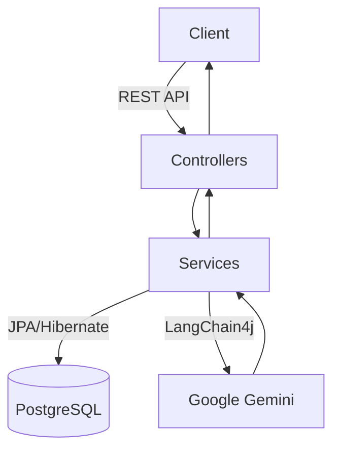

# CareerPilot AI - Backend

CareerPilot AI is an advanced, AI-driven backend service that analyzes resumes, matches them to job descriptions, suggests actionable improvements, and generates customized skill-building roadmaps.

Built with **Spring Boot 3**, **PostgreSQL**, **LangChain4j**, and **Google Gemini 1.5**.

---

## 🌟 Key Features

1. **Authentication & Authorization**: JWT-based stateless authentication.
2. **Resume Upload**: Secure PDF parsing and text extraction using Apache PDFBox.
3. **AI Resume Analysis**: Semantic matching of resumes against Job Descriptions using Gemini via LangChain4j.
4. **AI Resume Improvement**: Generates powerful, metric-driven bullet points without hallucinating or faking experience.
5. **Skill Roadmaps**: Identifies missing skills and generates customized learning paths with estimated hours and mini-projects.
6. **Clean Architecture**: Domain-driven design with distinct separation between Controllers, Services, and Repositories.

---

## 🛠️ Technology Stack

- **Java 21**
- **Spring Boot 3** (Web, Data JPA, Security)
- **PostgreSQL** (with Flyway for migrations)
- **LangChain4j** (AI Orchestration)
- **Apache PDFBox** (Document parsing)
- **Testcontainers & Mockito** (Testing)
- **Docker & Docker Compose** (Containerization)

---

## 🚀 Getting Started

### Prerequisites
- JDK 21
- Docker & Docker Compose
- Google Gemini API Key

### 1. Environment Setup
Copy the `.env.example` file to `.env` and fill in your Gemini API key:
```bash
cp .env.example .env
```
Inside `.env`, set your key:
```
AI_GEMINI_API_KEY=your_gemini_api_key_here
JWT_SECRET=your_super_secret_jwt_key_at_least_256_bits_long
JWT_EXPIRATION=86400000
```

### 2. Run with Docker Compose
The easiest way to get started is by spinning up both the database and the backend service using Docker.

```bash
docker-compose up -d --build
```

The application will be accessible at `http://localhost:8081`.

### 3. Run Locally (Development)
If you prefer running the application outside of Docker (e.g., in your IDE):

Start only the database:
```bash
docker-compose up -d postgres
```

Then start the Spring Boot app:
```bash
mvn spring-boot:run
```

---

## 🧪 Testing

To run the unit and integration tests (requires Docker for Testcontainers):

```bash
mvn clean test
```

---

## 📂 Architecture & Data Flow



---

## 📜 API Endpoints

### Auth
- `POST /api/auth/register` - Register a new user
- `POST /api/auth/login` - Authenticate and receive JWT

### Resumes
- `POST /api/resumes/upload` - Upload a PDF resume (Multipart)

### Analysis
- `POST /api/analysis` - Analyze a resume against a JD
- `GET /api/analysis/{id}` - Fetch analysis results

### Improvement
- `POST /api/improvement/{analysisId}` - Generate resume improvements
- `GET /api/improvement/{analysisId}` - Fetch resume improvements

### Roadmap
- `POST /api/roadmap/{analysisId}` - Generate skill learning roadmap
- `GET /api/roadmap/{analysisId}` - Fetch roadmap

---
*Built with ❤️ for aspiring tech professionals.*
